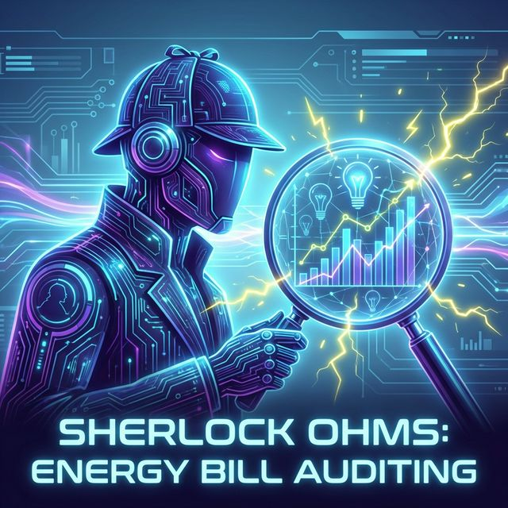
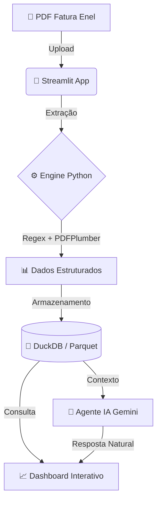
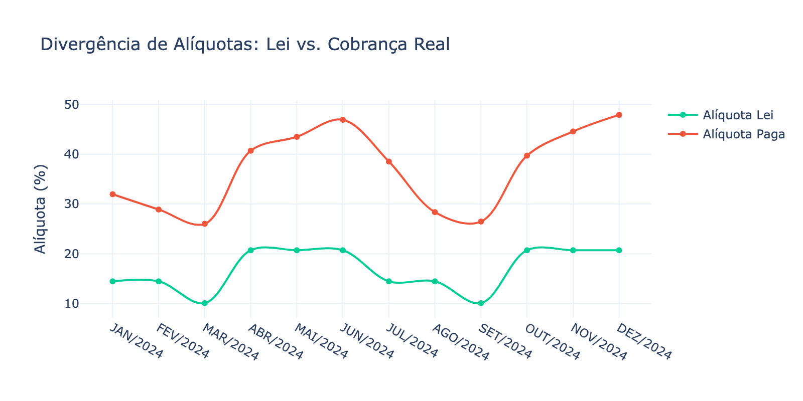
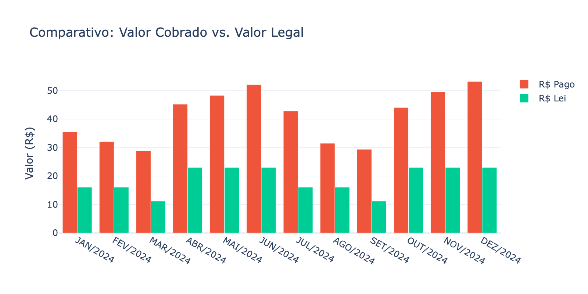
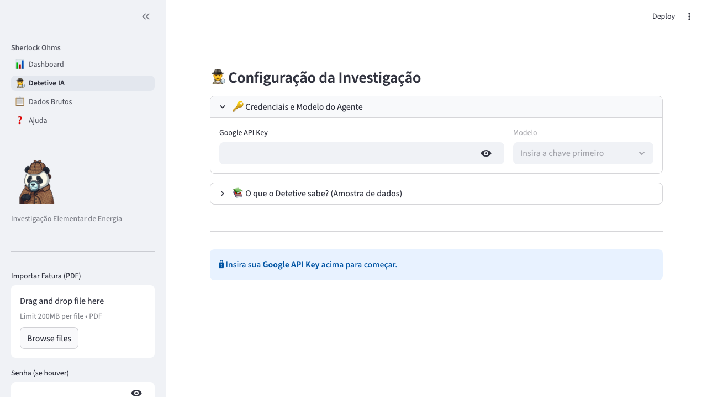

# 🕵️‍♂️ Sherlock Ohms: Como usei Python para auditar minha conta de energia (e descobri que estava pagando errado)

Você já parou para analisar detalhadamente sua conta de energia?

Recentemente, ao verificar minhas faturas da Enel, percebi algo curioso: a **Taxa de Iluminação Pública (CIP/COSIP)** muitas vezes representava uma parcela maior do que eu esperava. A dúvida era inevitável: *"Será que esse cálculo está correto?"*

Para responder a essa pergunta, decidi não apenas confiar no papel, mas usar a tecnologia a meu favor. Foi assim que nasceu o **Sherlock Ohms**.

## 💡 O Problema

A cobrança da Contribuição de Iluminação Pública (CIP) deve seguir legislações municipais específicas. No meu caso, a referência é a **Lei Municipal nº 757/2003**.

O desafio era manual e trabalhoso:
1. Pegar todas as faturas pagas (PDFs).
2. Verificar o consumo em kWh de cada mês.
3. Consultar a tabela da Lei 757/2003 para encontrar a alíquota correta (que varia de acordo com faixas de consumo).
4. Calcular o valor devido e comparar com o valor cobrado.

Ao fazer isso manualmente, o resultado foi surpreendente:

> [!IMPORTANT]
> **Os valores não batiam**. Eu estava pagando uma taxa calculada incorretamente todos os meses.

## 🛠️ A Solução

Como desenvolvedor, transformei essa auditoria manual em um sistema automatizado e inteligente. Criei o **Sherlock Ohms**, uma aplicação web capaz de ler faturas, extrair dados e realizar uma "engenharia reversa" dos impostos.

### 🏗️ Arquitetura da Solução

### O que o sistema faz?
- **Extração Automática:** Lê arquivos PDF das faturas (Enel-CE), inclusive protegidos por senha.
- **Auditoria Legal:** Aplica automaticamente as regras da **Lei 757/2003**.
    - Ex: Se você consumiu entre 401 e 500 kWh, a lei prevê uma alíquota de **20.72%** sobre a tarifa base de iluminação.

- **Comparativo Visual:** Gera gráficos e relatórios mostrando exatamente a diferença entre o "Valor Pago" e o "Valor Calculado pela Lei".

- **Inteligência Artificial:** Integrei um agente de IA (Google Gemini) para que eu possa conversar com meus dados, perguntando coisas como *"Qual foi o mês com maior divergência na taxa de iluminação?"*.

## 🚀 Tecnologias Utilizadas

Para construir essa solução, utilizei uma stack moderna de Data Science e Engenharia de Software:
*   **Python**: A linguagem base para todo o processamento.
*   **Streamlit**: Para criar o dashboard interativo e focado em dados.
*   **DuckDB & Parquet**: Para armazenamento local de alta performance.
*   **Plotly**: Para visualização de dados.
*   **Google Gemini API**: Para o assistente de IA integrado.

## 🏁 Conclusão

O projeto, que começou como uma simples curiosidade para validar uma cobrança, se tornou uma ferramenta completa de auditoria de energia elétrica. Isso reforça como a programação pode ser usada para resolver problemas reais do nosso cotidiano e trazer mais transparência para nossas despesas.

O código é aberto e pode servir de inspiração para quem quer auditar suas próprias contas ou aprender mais sobre processamento de dados e automação com Python.

🔗 **Confira o projeto no GitHub:** [Link do Repositório Aqui](https://github.com/wilkneMaia/sherlock-ohms)]

---
#Python #DataScience #Automação #Energia #Streamlit #Inovação #Dev #Tech
